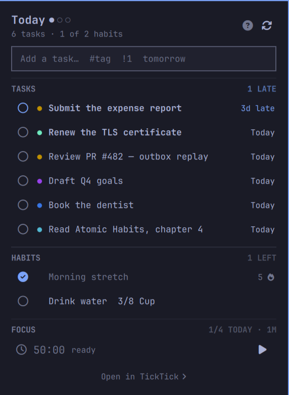

# TickTick for Omarchy

**What's due and what you haven't done yet, in the Omarchy bar.** Tasks,
habits and a focus timer in one popup — add, edit and complete without
leaving the desktop.



The bar shows a count (` 3  2♦` — three tasks due, two habits open) and
turns urgent when something is late. Left click opens the panel.

## Features

- Tasks due today, tomorrow, or the next seven days, overdue ones first
- Edit a task in place — `e` fills the add field with the task's own line
- Completing a task or checking a habit in is a click on its circle — the
  row itself is not a hit target, so a stray click costs nothing
- Habits with today's state and a running streak
- Quantified habits (8 cups of water) advance one step per click
- Quick-add field — type a title, hit enter, it lands due today
- **Undo window** — a completion or check-in is held for a few seconds before
  it is sent, so a misclick costs nothing
- **Focus timer** — a pomodoro that uses your TickTick durations, counts down
  in the bar, and uploads each finished block to your focus statistics
- Fully keyboard driven, with an in-panel shortcut list
- Tag colours come straight from TickTick; due state follows your Omarchy theme
- Everything is theme aware and follows the bar's vertical/horizontal layout

## Requirements

| Dependency | Required | Why |
|---|---|---|
| Omarchy 4 (Quattro) with Quickshell | yes | the shell that hosts the plugin |
| `python3` | yes | the CLI; standard library only, no pip packages |
| `curl` | no | not used — the CLI speaks HTTP through `urllib` |
| A TickTick account | yes | free accounts work; habits need TickTick's own habit feature |

No external Python packages, no build step, and nothing is compiled.

## Install

This is a local fork of the upstream [omarchy-ticktick](https://github.com/SotoAugusto/omarchy-ticktick)
plugin, kept under a private id so it is never pulled or run from the remote
repository. It lives in the `omarchy-setup` repo and is linked into place with
GNU Stow:

```bash
stow -t ~ plugins          # from ~/Documents/omarchy-setup
omarchy restart shell
```

The plugin directory on disk is
`~/.config/omarchy/plugins/io.github.josecamporivas.ticktick/`.

Then click the widget in the bar. It shows a plug icon until it is
connected, and clicking it opens a setup card with three steps and a paste
field:

1. Open `ticktick.com` and sign in
2. `F12` → **Application** → **Cookies** → `https://ticktick.com`
3. Copy the value of the cookie named **`t`**, paste it, press Connect

That is the whole setup. The field is masked, the token is handed to the CLI
through a file in a `0700` directory rather than on a command line, and the
file is deleted as soon as it is read. Nothing reads your browser.

Why a cookie and not a password: see [About the API](#about-the-api). Short
version — TickTick's risk control rejects scripted password logins, so the
browser session is the reliable path.

If you would rather stay in a terminal:

```bash
~/.config/omarchy/plugins/io.github.josecamporivas.ticktick/bin/omarchy-ticktick login --token -
```

`--token -` prompts with the input hidden, so the credential stays out of
your shell history.

When the token eventually expires, the panel returns to the same card and
says so. Reconnecting is the same paste.

## Removal

```bash
stow -D -t ~ plugins       # from ~/Documents/omarchy-setup
omarchy plugin remove io.github.josecamporivas.ticktick
```

That disables the widget, drops its entry from `~/.config/omarchy/shell.json`,
and unlinks the plugin directory. Two things live outside it and are left
behind on purpose, because they are your data and your credential:

```bash
omarchy-ticktick logout                     # forget the token + keyring entry
rm -rf ~/.local/state/omarchy/io.github.josecamporivas.ticktick      # remove the cache and session file
```

Run `logout` **before** removing the plugin if you want the keyring entry
cleared too — the CLI is what knows how to clear it, and removal deletes the
CLI. Nothing in TickTick itself is touched: no tasks, habits, or focus
sessions are deleted by uninstalling.

## About the API

TickTick's documented Open API (v1, OAuth) has **no habits endpoint at all**.
It covers projects and tasks and nothing else. This plugin therefore speaks
the same private v2 API the TickTick web app uses, authenticated with a
session token.

That is a deliberate trade and you should know what you are taking on:

- It is undocumented. TickTick can change or break it without notice.
- Scripted password login is unreliable and risky. `/api/v2/user/signon`
  answers a *correct* password with `username_password_not_match` when its
  risk control does not recognise the client, and repeated attempts get the
  account flagged. Use the browser token.
- The edge rejects requests that imitate the web app too closely. Sending
  `Origin`/`Referer`, or the full `x-device` object from TickTick's own
  bundle, returns `access_forbidden`; a minimal `x-device` is what works.
- No password is written to disk. Only the session token is, at
  `~/.local/state/omarchy/io.github.josecamporivas.ticktick/session.json`, mode 0600.
- `/api/v2/user/signin` — the path several published wrappers still use — is
  a dead 404. The live one is `/user/signon`.

Sessions expire eventually. When one does the panel returns to its setup card
and asks for a fresh token. There is no automatic renewal: it would need a
stored password, and TickTick refuses scripted password logins anyway, so the
machinery would sit there unable to do the one thing it exists for.

Using TickTick's Chinese service instead? Set `TICKTICK_DOMAIN=dida365.com`.

## How it fits together

The shell never talks to TickTick. `bin/omarchy-ticktick` owns the session
and every request, and writes a cache to
`~/.local/state/omarchy/io.github.josecamporivas.ticktick/data.json`. `Panel.qml` watches that file
and shells back out for writes. So a long-lived credential stays out of the
shell process, and every mutation is one command you can run yourself.

```
bin/omarchy-ticktick   session, API calls, the JSON cache
Model.js               task filtering, due labels, habit streaks (node-testable)
Service.qml            everything that must exist once, not once per screen
Panel.qml              the popup — a view of the service
BarWidget.qml          the bar slot
```

### Multiple monitors

A bar surface is created per monitor, so the widget and its panel exist once
per screen. Anything stateful left in the panel is therefore duplicated, and
that is not merely wasteful: two focus clocks each upload the block they
finish, inflating the very statistics the timer exists to keep honest.

`Service.qml` is a `service`-kind plugin, which the shell mounts exactly once
and hands to views through `shell.serviceFor(id)` — the same arrangement the
first-party media plugin uses. It owns the cache, the sync timer, the write
queue, the undo window, and the focus clock. The panels render it and keep
only what is genuinely per-screen, such as which date range that screen is
showing.

Panel routing is the bar's job, not the plugin's. A widget lives once per
monitor, but an IPC target resolves to a single handler, so a keybind used to
open the panel on whichever instance registered first. The bar already
answers this for `shell.summon` by asking Hyprland which output is focused,
so the plugin's own IPC calls borrow that resolution rather than acting
locally.

Two things stay defensive even so, because separate processes are involved:
delivery of the outbox runs under an exclusive lock, and timer-driven syncs
pass `--max-age` so a sync another process just finished is not repeated.

### CLI

```bash
omarchy-ticktick login --token -            # paste the browser's `t` cookie
omarchy-ticktick login [--email ADDR]          # password fallback
omarchy-ticktick sync [--scope tasks|habits|pomo|full]
omarchy-ticktick add "Pay rent" --due today [--priority 0|1|3|5] [--tags work,ops]
omarchy-ticktick update <taskId> [--title T] [--due D] [--priority P] [--tags a,b]
omarchy-ticktick complete <taskId>
omarchy-ticktick reopen <taskId>
omarchy-ticktick delete <taskId>
omarchy-ticktick checkin "Read" --toggle    # by name or id
omarchy-ticktick checkin "Water" --value 3
omarchy-ticktick pomo status                # today's focus stats + settings
omarchy-ticktick pomo log --minutes 50      # upload a finished focus block
omarchy-ticktick status                     # cache state as JSON
omarchy-ticktick logout
```

Every command prints JSON on stdout and errors on stderr, so it scripts and
binds cleanly.

## Settings

Configure in Setup > Plugins, or inline on the bar entry in
`~/.config/omarchy/shell.json`:

| Key | Default | What it does |
|---|---|---|
| `syncInterval` | `5 minutes` | `2 minutes`, `5 minutes`, `15 minutes`, `1 hour`, or `Only when opened`. |
| `horizon` | `Today` | `Today`, `Tomorrow`, or `Next 7 days`. |
| `includeOverdue` | `true` | Count and list work that is already late. |
| `showTasks` | `true` | Show the task section. |
| `showHabits` | `true` | Show the habit section. |
| `maxTasks` | `12` | Rows before the list is capped with a "+N more". |
| `barLabel` | `Count` | `Count`, `Next` (next task's title, scrolling), or `Icon`. Right-click the widget to cycle it. |
| `showPomo` | `true` | Focus section, and a live countdown in the bar. |
| `undoSeconds` | `6` | How long an action is held before sending. `0` disables undo. |
| `pomoMinutes` | `0` | Focus length. `0` follows your TickTick account. |
| `shortBreakMinutes` | `0` | Short break. `0` follows your account. |
| `longBreakMinutes` | `0` | Long break. `0` follows your account. |
| `longBreakInterval` | `0` | Long break every N blocks. `0` follows your account. |

```json
{
  "bar": {
    "layout": {
      "right": [
        { "id": "io.github.josecamporivas.ticktick", "horizon": "Next 7 days", "maxTasks": 20 }
      ]
    }
  }
}
```

## Keys and clicks

| Where | Input | Action |
|---|---|---|
| Bar | left | open the panel |
| Bar | middle | sync now |
| Bar | right | cycle the label: counts → next task → icon only |
| Panel | click the circle | complete the task / check the habit in |
| Panel | click the title | cycle the range (Today → Tomorrow → 7 days) |
| Panel | `Open in TickTick ›` | open the web app and close the panel |
| Panel | `↑` `↓` | move between tasks and habits |
| Panel | `enter` | complete the task / check the habit in |
| Panel | `u` | undo the held action |
| Panel | `a` | focus the quick-add field |
| Panel | `e` | edit the selected task in that same field |
| Panel | `r` | sync now |
| Panel | `p` | start or pause focus |
| Panel | `d` / `del` | discard the focus block (not logged) |
| Panel | `g` / `G` | first / last row |
| Panel | `tab` | next bar panel |
| Panel | `v` / `V` | cycle the range forward / back |
| Panel | `?` | show or hide the shortcut list |
| Panel | `esc` | back out one layer, then close |

The shortcut list is reachable both ways: `?` from the keyboard, and the
**?** button in the panel header for the mouse. A shortcut list you can only
reach by shortcut helps the people who need it least.

IPC, for keybindings:

```bash
omarchy-shell io.github.josecamporivas.ticktick toggle
omarchy-shell io.github.josecamporivas.ticktick sync
omarchy-shell io.github.josecamporivas.ticktick focus       # start or pause a block
omarchy-shell io.github.josecamporivas.ticktick focusStop   # discard it
omarchy-shell io.github.josecamporivas.ticktick cycleLabel   # counts / next task / icon
```

`toggle`, `open`, `close`, `show`, and `hide` open the panel on the monitor
Hyprland currently has focused, not on whichever copy of the widget happens
to own the IPC target. `sync` goes to every instance, since refreshing is not
a place.

## Tests

```bash
node --test tests/model.test.js
```

`Model.js` holds every piece of logic that can be wrong without being
visibly wrong — timezone handling on all-day due dates, streak counting
across a day that is still open, overdue sorting — so it is plain JS with no
QML imports and runs under node.

## Background sync

The interval is a short list rather than a number field, because the useful
range is narrow and the costs are not obvious:

| Option | Meaning |
|---|---|
| `2 minutes` | for a busy shared list; the most this should ever poll |
| `5 minutes` | the default |
| `15 minutes` | fine for a personal list |
| `1 hour` | you mostly add tasks rather than watch them |
| `Only when opened` | no background polling at all |

Opening the panel always syncs, and so do the sync button and `r`, so this
setting governs only the idle case — how fresh the bar's count is while you
are not looking at it.

Two things make a short list better than a free-form seconds box here. Each
tick is five HTTP requests, and **a bar surface exists per monitor**, so a
two-screen desktop fires the timer twice. To keep that from doubling the
traffic, a timer-driven sync passes `--max-age`: whichever instance gets
there first does the work, and the second sees a fresh cache and exits
without a request. Explicit syncs never skip, and neither does a sync with
anything queued in the outbox.

```bash
omarchy-ticktick sync --max-age 285   # what the timer runs
```

`Only when opened` still syncs once shortly after the shell starts —
otherwise the bar would show a stale count until you first clicked it.

## Why writes feel immediate

A write costs a sync, and a full sync is five HTTP round trips — about two
seconds. Adding a task cannot change your habits, your check-ins, or your
pomodoro settings, so re-fetching them afterwards spends most of that second
confirming that nothing happened.

Syncs are therefore scoped. A task write refreshes tasks only, a check-in
refreshes habits only, and a finished focus block refreshes the pomodoro
stats. Sections outside the scope keep their cached values.

```bash
omarchy-ticktick sync --scope tasks     # ~0.6s, vs ~2.0s for full
```

On top of that, a quick-added task appears in the list the moment you press
enter, before the request completes. The next cache write replaces it with
the real one. The placeholder row is inert — it has no id yet, so it cannot
be completed by accident.

## Offline

A write made while TickTick is unreachable is not lost and not silently
dropped. It goes into an outbox at
`~/.local/state/omarchy/io.github.josecamporivas.ticktick/outbox.json`, and the change is applied to
the local cache immediately — so the task appears in the list, the habit
shows checked, and both survive a shell restart rather than living only in
the panel's memory.

Every sync drains the queue before reading anything back, so what you get
afterwards reflects your writes instead of contradicting them. The panel
shows a cloud and a count while anything is waiting; clicking it retries.

This is safe to replay because **every write carries a client-generated id** —
tasks, check-in entries, and pomodoro records alike. Sending a queued write
twice updates the same record instead of creating a duplicate.

Replays resolve against current server state rather than being sent verbatim.
A v2 update is a whole-object write, so a queued completion re-fetches the
task and changes only its status; anything you edited on another device in
the meantime survives. Queued check-ins re-query the day's entry before
deciding whether to add or update it.

A write that TickTick actively *rejects* is dropped rather than retried
forever, since replaying a rejection only earns another rejection. A write
that never got a verdict — no network, or a rate limit — is kept and retried.
When the queue stalls, the remaining entries stay in order instead of each
one hammering a dead network.

```bash
omarchy-ticktick status     # includes the queued count
```

## Quick add

The field takes more than a title:

```
Renew the TLS cert #work !1 tomorrow
```

| Syntax | Does | Whose convention |
|---|---|---|
| `#tag` | attaches a tag, lowercased | TickTick's — `#` is what its apps use |
| `!1` `!2` `!3` | priority: high, medium, low | this plugin's |
| `!high` `!med` `!low` | the same, spelled out | this plugin's |
| trailing `today` / `tomorrow` / `yesterday` / `2026-09-01` | sets the due date | TickTick parses dates from text too |

Everything not consumed becomes the title, so the line above creates *Renew
the TLS cert*, tagged `work`, high priority, due tomorrow. With no syntax at
all it is a plain task due today.

TickTick has no quick-add symbol for priority — it is still an open request
on their forum — so `!` is defined here rather than borrowed. `#` and the
date words match what TickTick already taught you.

Three details worth knowing:

- A date word only counts at the **end**. `Plan today standup` keeps its
  word; `Standup notes for today` does not, and the preposition goes with the
  date rather than being left dangling.
- An unrecognised `!token` is left alone in the title.
- Tags are lowercased, because that is the key tasks reference them by.

The same syntax is listed under `?` in the panel.

### Editing uses the same line

Press `e` on the selected task and the field fills with the line that would
have created it — `Renew the cert #work !1 tomorrow`. Change it, press enter,
and the task becomes what the line says. Escape cancels.

So there is no separate editor and no second syntax: what you type to make a
task is what you edit to change it. Removal falls out of that — delete
`#work` from the line and the tag is gone, drop `!1` and the priority clears.
A date is applied only when the line carries one, so an undated task stays
undated.

## The view, and what it hides

The panel opens on the horizon you configured — `Today` by default, meaning
overdue work plus today's. That is the point: a bar widget should answer
"what now", not show a backlog.

But a task you just created must never be invisible, so:

- **Click the title** (or press `v`) to cycle the range: Today → Tomorrow →
  Next 7 days → back to Today. `V` steps the other way.
- Position dots beside the title (`● ○ ○`) show how many ranges there are and
  which one you are on. They are deliberately not a chevron: a chevron
  promises a dropdown, and this control cycles.
- The tooltip names where the next click lands rather than a direction, since
  the control wraps — "Show Tomorrow", then "Show Next 7 days", then "Back to
  Today".
- **Adding something due later widens the view automatically.** Type
  `Ship the release tomorrow` from a Today view and the view moves to
  Tomorrow so you can see what you just made.

Widening is a look, not a setting. Closing the panel returns it to your
configured `horizon`, so the default never drifts.

## Long titles

A title wider than the row is elided — until you point at it. **The row under
the mouse, or under the keyboard cursor, scrolls to reveal the rest**, pauses
at the end, and slides back.

Only that one row moves. A list where every long title animates at once cannot
be scanned, and scanning is what the list is for. Nothing scrolls until you
show interest in a specific row, and a row that stops mid-scroll returns home
rather than sitting half off the edge.

The bar behaves the same way in `Next` mode, where the label is a task title:
it scrolls rather than being cut at 28 characters, and pauses at each end
instead of wrapping around. A continuous wrap — the way the media widget
scrolls a track name — leaves the bar slot looking empty for part of every
loop, which a track name can afford and a task reminder cannot. Reading speed
is constant in both places, so a longer title takes longer rather than moving
faster.

The slot keeps a fixed width in `Next` mode. A bar item that resized with
every task title would shove its neighbours sideways each time you completed
something.

## Colours

TickTick stores a colour for **tags** and for **projects**, and this shows the
tag colour as a dot beside the task title. That is the only colour in a task's
data — there is no colour field on a task itself.

Overdue, today, and upcoming have **no colour in the API**. Every TickTick
client paints that itself, so this one paints it from your Omarchy theme
rather than hardcoding their palette: overdue takes the accent colour, today
takes normal foreground, anything further out is muted. A fixed red would
fight every theme you switch to.

Priority is the same story — the API gives an integer, not a colour — so a
high-priority task is shown in bold rather than in TickTick's red.

Note that dots only appear on tasks that are both tagged **and** dated, since
the panel lists dated tasks.

## Undo, and why it is a delay

Completing a task or checking a habit in does not fire immediately. The
action is held for `undoSeconds`, an undo row appears, and only when the
window lapses is anything sent. Closing the panel sends everything still held
— closing is not a cancel.

Held actions are a **stack**, not a single slot. Ticking four things off in a
row is how a list actually gets cleared, and holding only the newest would
mean the first three were already gone by the time you noticed the mistake —
the undo window would fail exactly where mistakes cluster. Each action keeps
its own countdown, `u` takes back the most recent, and pressing it repeatedly
walks back through them. The row shows how many are behind the one on offer
(`+2 more`).

It works this way because the alternative does not work. Completing a
*recurring* task rolls it forward to its next occurrence, and a later
`reopen` does not put that back; you get a different task in a different
state. An undo that never sends the request is the only one that is
actually reversible.

## Focus timer

TickTick's pomodoro is client-side. There is no server-side running clock to
join, so this plugin runs its own and uploads each completed block through
`POST /batch/pomodoro` — the same thing TickTick's apps do. Your durations,
break lengths, long-break interval, and daily goal are read from the account
(`/user/preferences/pomodoro`), so the rhythm matches the phone app.

Durations are settable per widget. Each of `pomoMinutes`,
`shortBreakMinutes`, `longBreakMinutes`, and `longBreakInterval` defaults to
`0`, meaning "use whatever TickTick says" — so the panel tracks your account
until you deliberately disagree with it, and only the fields you set are
overridden:

```json
{ "id": "io.github.josecamporivas.ticktick", "pomoMinutes": 25, "longBreakInterval": 3 }
```

While a block runs the bar shows the countdown instead of the task count.
Stopping a block early does **not** log it: TickTick counts a pomodoro on
completion, and banking partial blocks would inflate the statistics this is
meant to keep honest.

## Changes

[CHANGELOG.md](CHANGELOG.md) — note that `0.2.0` renames the
`refreshIntervalSec` setting to `syncInterval`.

## Licence and acknowledgements

MIT — see [LICENSE](LICENSE).

Built on Omarchy and Quickshell, and it speaks TickTick's private v2 API,
which several other projects mapped out first. Who contributed what, and what
this plugin owes them, is in
[ACKNOWLEDGEMENTS.md](ACKNOWLEDGEMENTS.md).

Unofficial and unaffiliated: not endorsed by or supported by TickTick
(Appest Inc.). Please do not report breakage here to them.

## Limitations

- Read plus the core writes. No editing titles, no rescheduling, no
  subtasks, no moving between projects — do those in TickTick.
- Habit check-ins are all-or-step. Arbitrary values need `--value`.
- One account.
- The focus timer lives in the shell process. Restarting the shell loses a
  running block; it is not persisted.
- A stopped focus block is discarded, never logged.
